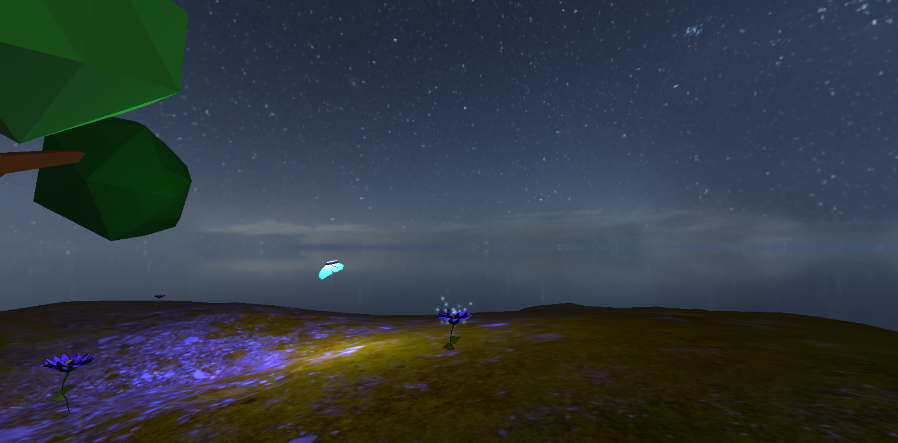
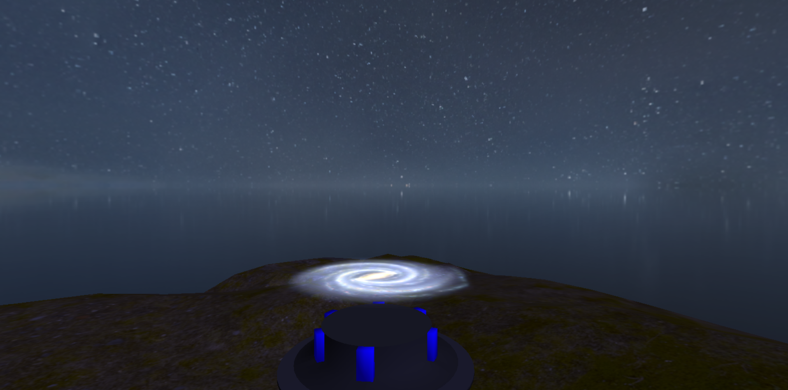
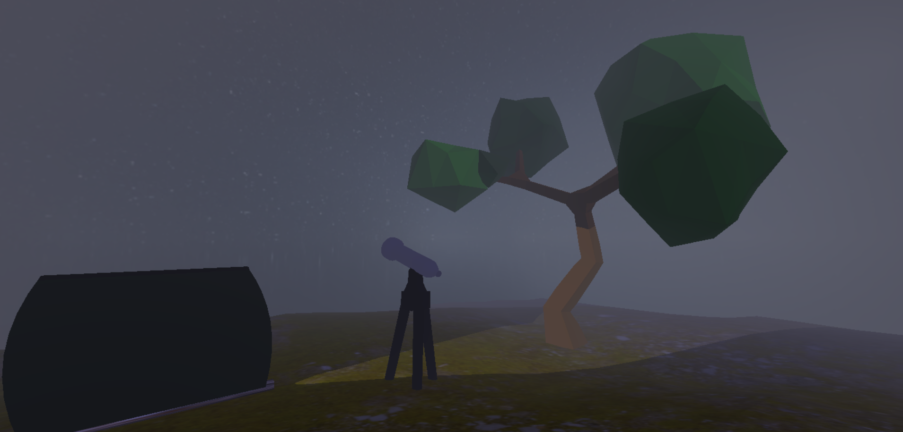

# OpenGL-Project
## Project Overview

This project is an interactive scene developed using OpenGL, featuring a combination of static and dynamic objects, custom shaders, and various interactive elements. The goal of this project is to create a visually engaging and responsive environment that demonstrates the power of OpenGL's rendering capabilities and custom shader effects.

## Features

- **Static and Dynamic Objects**: The scene contains both static objects (e.g., buildings, terrain) and dynamic objects (e.g., moving characters, animated elements).
- **Custom Shaders**: Several custom shaders have been implemented to enhance the visual effects:
  - **Per-Vertex Shader**: A basic shader that handles vertex-level processing to manipulate object appearance.
  - **Banner Shaders**: Used for rendering banners or text elements within the scene with dynamic effects like scrolling or lighting changes.
  - **Other Shaders**: Additional shaders for various effects such as lighting, shadowing, and texture mapping.
- **Interactive Elements**: The scene includes interactive objects that users can manipulate (e.g., moving objects, changing camera angles, etc.).
- **Lighting and Textures**: Dynamic lighting models (e.g., point lights, spotlights) and various textures applied to objects to simulate realistic materials.

## Overview

